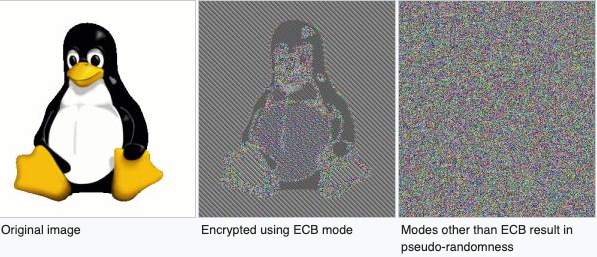

# Valkuilen en uitdagingen bij cryptografie in Java

In de vorige editie van het Java magazine, hebben we een introductie in cryptografie gegeven. In dit artikel gaan we verder in op de do's en dont's als het gaat om het gebruik van deze cryptografie in Java. Heb je het vorige artikel gemist of wil je nog even terug naar de basis voorbeelden? Kijk dan gerust even in onze repository op https://github.com/nbaars/java-magazine-article/ .

image::images/qr-repo.png[Repo-url,100,50]

## Symmetrische do's en dont's

In ons vorige artikel legde we het een en ander uit over symmetrische cryptografie. Zo zijn we in gegaan op block operation modes, ciphers, Initialization Vectors (IVs), Nonces en padding. Waar moet je in dat geval dan eigenlijk op letten? Laten we gaan kijken.

### Tips voor block operation modes

Laten we maar direct met de belangrijkste aanbeveling starten als het gaat om de block operation modi. Als je AES gebruikt, gebruik dan nooit AES-ECB (Electronic CodeBook): Zoals je kan zien op de afbeelding hieronder van Wikipedia, is een encryptie met ECB (middelste afbeelding) een verschuiving van de bits, maar is de originele structuur nog steeds op te halen en is de content ook te herleiden.

.Voorbeeld van problemen bij ECB (https://en.wikipedia.org/wiki/Block_cipher_mode_of_operation)

van links naar rechts: geen encryptie toegepast, ECB encryptie toegepast, CBC of CTR encryptie toegepast.
Er is wel een uitzondering: je kan ECB gebruiken als het te versleutelen bericht past in 1 blok van maximaal 128 bits, alleen komt een dergelijk klein bericht niet zo vaak voor.

Kies je voor AES-CBC (Cipher Block Chaining)? Voeg dan ook een HMAC toe: CBC is gevoelig voor een padding oracle attack, deze attack is gebaseerd op het veranderen van bytes in de padding om uiteindelijk een afleiding van de sleutel te kunnen doen en het bericht te kunnen decrypten. Om dit te voorkomen dien je een HMAC toe te passen op de ciphertext. Wordt de ciphertext dan aangepast, dan zal de HMAC validatie falen. Zorg ervoor dat gebruikt maakt van de combinatie “Encrypt then MAC” Alle andere vormen (“MAC then encrypt”, “MAC and encrypt”) zijn kwetsbaar, controleer altijd eerst de MAC en ga dan pas verder met ontsleuteling van het bericht.

Hoe dan ook: zorg ervoor dat je bij decryptie zo min mogelijk feedback deelt, zoals ook te zien is in onze voorbeelden op Github. Als je wel meer specifieke decryptie fouten deelt, wordt het veel gemakkelijker voor een aanvaller om je ciphertext te ontsleutelen als bijvoorbeeld de HMAC mist.

Gebruik je AES-GCM (Gallois Counter-Mode)? Bij GCM is het van belang om ook de `GCMParameterSpec` klasse te gebruiken in plaats van de `IVParameterSpec`: ten slotte heb je anders de integrity check die GCM zou bieden niet verkregen. Hoewel dit niet voor alle security providers geldt: bij BouncyCastle wordt er dan een standaard MAC van 16 bytes gemaakt. Daarnaast kan je met `GCMParameterSpec` associated text opgeven. Dit kan je gebruiken om context te geven aan hetgeen je versleuteld: bijvoorbeeld door user-ID op te nemen als associated text kan je een link maken tussen het subject waar de data over gaat en de ciphertext. 

### Nog even terug naar IVs en Nonces bij AES

Er is een belangrijk verschil op te merken tussen een IV en een nonce (number used ONCE), een IV moet random zijn en een NONCE kan ook gebaseerd zijn op een counter. Dit wordt extra belangrijk bij AES-GCM. AES-GCM is een voorbeeld van AEAD (Authenticated Encryption with Associated Data), waar een Nonce verplicht is. Deze Nonce kan gewoon een counter zijn, het is daarbij wel belangrijk om dit nummer **exact 1 keer** te gebruiken anders is er een aanval op de gebruikte sleutel. Het voert te ver om in dit artikel hieraan aandacht te besteden, zie footnote:[https://tools.ietf.org/id/draft-irtf-cfrg-gcmsiv-08.html] voor meer informatie.

In footnote:[CWE-329: http://cwe.mitre.org/data/definitions/329.html] kun je de aanbeveling lezen waarom de IV random moet zijn, ook een voorspelbare IV (toegestaan bij een nonce) levert problemen op. Laten we kijken naar AES CBC waarbij gebruik wordt gemaakt van een counter als IV.  Stel Mallory krijgt van Alice de uitdaging om de inhoud van het bericht te raden, stel een veld heeft een vast aantal waarden: "ongehuwd, gehuwd, samenwonend". Mallory heeft natuurlijk een kans van 1 op 3 om het juist te raden, maar laten we eens kijken of Mallory dit altijd kan winnen:

In AES CBC is encryptie als volgt gedefinieerd:

[quote, https://en.wikipedia.org/wiki/Block_cipher_mode_of_operation]
____
C~i~ = E(key, P~i~ ⊕ C~i-1~) +
C~0~ = IV
____

In ons geval: C~alice~ = E(key, P~alice~ ⊕ IV~alice~) = E(key, getrouwd ⊕ IV~alice~)

De taak aan Mallory is nu: gegeven het versleutelde bericht van Alice(C~alice~) kan Mallory achterhalen dat Alice de waarde "getrouwd" heeft versleuteld met 100% zekerheid? Dat kan, Mallory heeft kennis van de IV gebruikt door Alice, Mallory weet ook de volgende IV(IV~mallory~) dus als Mallory het volgende bericht maakt:

P~mallory~ = getrouwd ⊕ IV~mallory~ ⊕ IV~alice~

Als we dit versleutelen krijgen we:

C~mallory~ = E(key, P~mallory~ ⊕ IV~mallory~) = E(key, (getrouwd ⊕ IV~mallory~ ⊕ IV~alice~) ⊕ IV~mallory~)

IV~mallory~ ⊕ IV~mallory~ kunnen we tegen elkaar wegstrepen dus:

C~mallory~ = E(key, getrouwd ⊕ IV~alice~)

Nu kan Mallory dus kijken of C~mallory~ gelijk is C~alice~ als dit zo is, weet Mallory dat Alice de waarde "getrouwd" heeft gebruikt.

Dit voorbeeld is te vinden in onze Github repository footnote:[https://github.com/nbaars/java-magazine-article/].

Werk je toch met AES-GCM en kan je een onvoorspelbaar eenmalig gebruikte nonce niet garanderen? Probeer dan random IVs met een beperkt gebruik van de sleutel. Je mag namelijk ook die IV niet twee keer gebruiken. Dit wordt lastiger, omdat de meeste Java implementaties maar 96 bits aan effectieve IV lengte hebben. Dit betekent, volgens footnote:[NIST Special Publication: https://dx.doi.org/10.6028/NIST.SP.800-38D] dat je maximaal 2^32 berichten mag encrypten met dezelfde sleutel. Dit kan nog eens een stuk minder worden door het volgende verschijnsel: op het moment dat je meerdere services hebt die een eigen secure random initialiseren en die vervolgens gebruiken om een random IV te genereren, dan is de kans aanwezig dat deze secure-random periodes overlap hebben op de korte termijn. Daarom is het aan te bevelen om het aantal encryptie operaties met dezelfde key meer te limiteren.

### Algemene tips

Welke algoritmes zijn ok? Als laatste is het van belang om de juiste ciphers te kiezen: gebruik, in geval van twijfel, alleen AES-128, AES-256, CHACHA-20 in combinatie met de HMAC Poly-1305.
Randomize IVs: een weggevertje, maar zorg ervoor dat je altijd random IVs gebruikt.
Roteer sleutels: roteer je sleutels: niet alleen om eventuele zwakheden in implementaties (zoals bij GCM), maar ook omdat je niet zeker weet wanneer de sleutel gecompromitteerd wordt.
Op mobiel? Beveilig de sleutel! Zorg ervoor dat je de Trusted Execution Environment/Secure Enclave kan gebruiken om de sleutel te beveiligen. Kan dat niet? Zorg ervoor dat de sleutel alleen tijdelijk op het apparaat is. Ruim hem ook altijd zelf op na gebruik: zero-ize de byte-array van de sleutel.

## Asymmetrische encryptie: do's en dont's

Ga geen grote plaintext blocken encrypten: Asymmetrische cryptografie is niet bedoeld voor grote blokken plaintext (meer dan de capaciteit van 1 block van de sleutel). Wil je toch grote blokken plaintext versleutelen? Gebruik dan het principe van envelope encryptie. Dan genereer je een symmetrische sleutel die je gebruikt voor het encrypten van de plaintext en je gebruikt asymmetrische cryptografie voor het encrypten van de symmetrische sleutel. Beide stuur je vervolgens op.
Gebruik geen PKCS#1 als padding: PKCS-1 padding is gevoelig voor padding oracle attacks. OAEP is dat veel minder. Moet je alsnog gebruik maken van PKCS-1? Zorg ervoor dat je generieke errors teruggeeft op het moment dat de padding niet klopt. Geef je namelijk specifieke errors terug, dan kan de aanvaller een padding oracle attack uitvoeren.
RSA? Start met RSA-2048: Gebruik geen RSA-1024. Wil je up to date blijven qua key length? NIST publiceert af en toe daar updates over. Kijk eens op keylength.com om daar snel een overzicht van te krijgen.
Let op: bij RSA is het heel gewoon om ECB als mode te gebruiken. Ten slotte kan je bij RSA-2048 ook 2048 bits in het block encrypten.
Roteer je sleutel! Net als bij symmetrische encryptie geldt hier hetzelfde: roteer je sleutel met regelmaat (periode is afhankelijk van het risico: hoog risico? Jaarlijks, laag risico? Een jaar of 3?).
RSA en java: Let op: RSA sleutels zijn gebaseerd op Big Integers: dit betekent dat de sleutel dus eigenlijk altijd in het geheugen blijft vanaf dat hij geïnitialiseerd is. Wil je sleutel lekkage bemoeilijken? Maak dan gebruik van de Trusted Execution Environment/Secure Enclave op mobiel of maak gebruik van libraries zoals LibSodium. 
Wil je toch graag gebruik maken van elliptische cryptografie? Kijk dan bij de website Safe Curves footnote:[Safe Curves website: https://safecurves.cr.yp.to/] om te zien of de curve daadwerkelijk te gebruiken is.

## HMAC

Bij het gebruik van een HMAC is het van belang om gebruik te maken van de juiste sleutel lengte. Doordat een hash functie snel te berekenen is, is een brute-force attack een reëel gevaar waar je rekening mee moeten houden. In footnote:[https://tools.ietf.org/html/rfc2104#section-3] is te lezen dat de lengte van de sleutel minimaal gelijk moet zijn aan de lengte van het hash output lengte. In de praktijk houden weining libraries rekening met deze eis, bijvoorbeeld een willekeurige JWT library (alg = H256) gooit geen exceptie als de lengte onder de grens is. Een voorbeeld van een dergelijke kwetsbaarheid is te vinden in WebGoat footnote:[https://webgoat.github.io/WebGoat/] in het onderdeel JWT tokens.

## Signature, HMACs: do's & dont's

Een signature ≠ HMAC: Iedereen met een beetje ervaring merkt al snel dat signature implementaties een stuk trager zijn dan HMACs. Het is dan ook vaak verleidelijk om een signature te verruilen voor een HMAC. Let wel op dat je dan non-repudiation kwijt bent: indien de verifiërende partij een andere is dan de schrijvende partij, dan zal de verifiërende partij ook ineens berichten kunnen maken bij een HMAC. Dit is niet het geval bij een signature.
Gebruik je signatures met RSA? Maak gebruik van de juiste padding: RSA PSS (Probabilistic Signature Scheme) is een betere vorm van padding om daadwerkelijk de veiligheid van een RSA-gebaseerde signature te versterken.

Gebruik je wel een HMAC? Zorg ervoor dat de sleutel even lang is als de output van je hashing algoritme. Gebruik bijvoorbeeld bij een SHA-256 gebaseerde HMAC een 256 bits lange sleutel.

## Timing attacks

Indien je met data werkt die een hoog risico met zich meedragen, zorg er dan voor dat de implementatie die je kiest timing-attack-resistant is. Bij een timing attack wordt het verschil in respons tijd gebruikt om iets af te leiden van de correctheid van hetgeen wat verstuurd wordt door de aanvaller: indien een HMAC validatie bij de eerste fout faalt of indien een padding check bij de eerste check verder faalt qua decryptie, dan leert de aanvaller daar meteen van. Daarom is het goed om timing resistant implementaties te gebruiken.

## Je security provider

Als laatste: Java maakt gebruik van meerdere security providers voor de daadwerkelijke implementatie van de cryptografische operatie. Zorg ervoor dat de juiste gebruikt wordt. Op Android betekent dat: patch je security provider en definieer niet welke je wil gebruiken, tenzij strict noodzakelijk. Op de back-end betekent dat: maak gebruik van van BouncyCastle vergeet deze niet in een static block als provider toe te voegen (`Security.addProvider(..) ` ). Let wel op: als je meerdere security providers op je classpath hebt welke dezelfde cipher/signature/HMAC supporten, moet je wel de provider opgeven, anders kan het wel eens door een andere provider uitgevoerd worden die ook support heeft voor de desbetreffende configuratie en op een lagere positie bij de provider list staat. Zie ook de voorbeelden onze Github repository footnote:[https://github.com/nbaars/java-magazine-article/].
