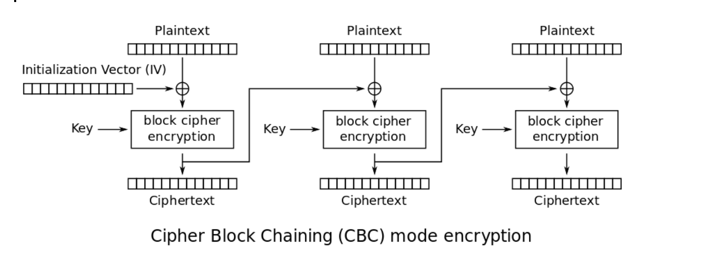
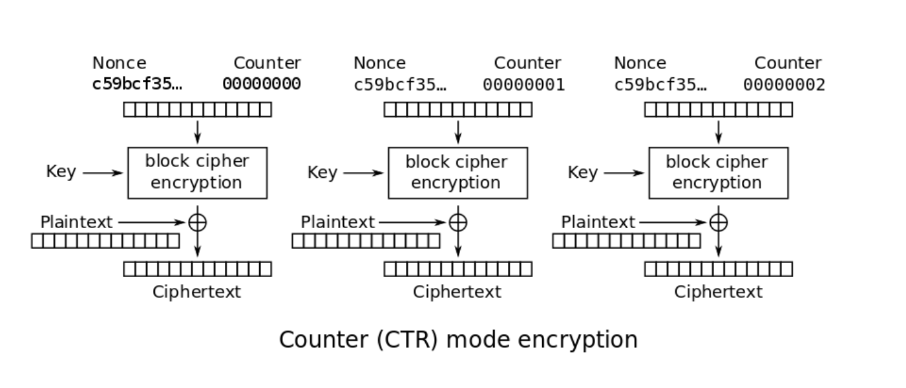

# Introductie tot cryptografie in Java

Wanneer je aan de slag moet met cryptografie in Java komen er allerlei zaken op je af: hoe bereik je wat je wil?
welke mechanismen kan je gebruiken? hoe doe je dat ongeveer?
We nemen je mee in dit artikel door een aantal basisbegrippen. Wil je meer weten? Dan zien we je terug in de volgende
uitgave van het Java-magazine met do’s en dont’s.

## Even terug naar wat basis begrippen

We komen cryptografie overal tegen in het dagelijks leven: wanneer we een website openen met HTTPS, wanneer we een moderne
smartphone aanzetten met versleutelde opslag tot en met
wanneer we berichtjes sturen naar onze vrienden/familie met Whatsapp/Signal/Telegram. Maar hoe werkt het nu? En
belangrijker: hoe passen we het toe in Java? Voordat we naar de code rennen, laten we eerst even wat basisbegrippen
uitleggen die in dit artikel vaak hergebruikt worden. Er zijn 3 security attributen die je graag wil bereiken met cryptografie:

- Confidentiality: hoe hou je geheimen geheim?
- Integrity: hoe voorkom je ongeautoriseerde aanpassingen?
- Non-repudiation: hoe kan je met zekerheid zeggen dat iemand een bericht daadwerkelijk verstuurd heeft?

Cryptografie kent een aantal soorten begrippen:

- Plaintext: de tekst waar geen cryptografische actie op vereist is om te lezen. Plaintext hoeft niet per se tekst te zijn: dit kan ook gewoon een serie bytes zijn die bijvoorbeeld bestaat uit gecompileerde applicatiecode.
- Ciphertext: de tekst waarop een encryptie operatie heeft plaatsgevonden. De inhoud is versleuteld of encrypted.
- Cipher: een geïnitialiseerd encryptie/decryptie algoritme.
- Encryption: het versleutelen van plaintext naar ciphertext.
- Decryption: het ontsleutelen van ciphertext naar plaintext.
- Signing: het ondertekenen van een bericht
- Signature: de handtekening als output van een sign operatie.

Nu we de basisbegrippen even wat uitleg hebben gegeven, kunnen we aan de slag.

## Streaming en block-operations

Voor veel encryptie algoritmes moet de computer allerlei rekenwerk doen op een serie aaneengesloten bits. Want, stel je
voor als je iedere 128 bits wil omdraaien in een transponeer operatie, dan is het wel handig als je dat iedere keer weer
met een blok van 128 bits kan doen. Hetzelfde geldt voor operaties waarover je een berekening wil doen. Dan is het handig
als je iedere keer met dezelfde lengte aan bits werkt om die bits als een getal weer te kunnen geven. Ciphers die op die
manier werken noemen we een “block-cipher”.
Daarentegen zijn er ook ciphers die bit-voor-bit kunnen werken. Dit noemen we zogenaamde “stream-cipher”. Daarin wordt
er vaak per bit een operatie gedaan: bijvoorbeeld een XOR tussen de plaintext bit en een stream aan random bits.

Maar wat nu als we bits overhouden? Stel je voor dat je in blokjes van 128 bits werkt en opeens is het laatste stukje
nog te versleutelen plaintext maar 32 bit. Wat doe je dan? Dan moet je de rest van het blokje opvullen, dit noemen we padding.

## Symmetrische encryptie

Een van de vormen van encryptie is de zogenaamde symmetrische encryptie. In dit geval delen Alice en Bob een sleutel
waarmee het bericht wordt versleuteld en kan worden ontcijferd. Binnen deze groep heb je zowel stream ciphers als
block ciphers in dit artikel beperken we ons tot volgende populaire algoritmen: AES en ChaCha20. De eerste zal bij
velen bekend in de oren klinken maar de tweede is een stream cipher met een aantal verrassende eigenschappen.

### AES

AES is een van de bekendste symmetrisch encryptie algoritmes. AES bestaat uit een aantal verschillende zogenaamde
“modes”, bijvoorbeeld AES-ECB, AES-CBC, AES-CTR. Een mode definieert hoe de ciphertext en de plaintext per block samen gebruikt
worden om de encryptie en decryptie te verzorgen. Laten we eens kijken naar AES-CBC, in afbeelding 1 zie je een schematische afbeelding

.AES CBC (https://en.wikipedia.org/wiki/Block_cipher_mode_of_operation)

In ieder blok wordt het bericht allereerst XOR’ed met de uitkomst uit de vorige blok, voor het eerste blok wordt er
gebruik gemaakt van een zogenaamde "Initialization Vector" (IV) om het eerste blok ook uniek te maken. AES-CBC is een
voorbeeld van block cipher en heeft padding nodig om te zorgen dat het uiteindelijke cipher block exact 128 bits groot is.
AES-CTR is een voorbeeld van een stream cipher de zogenoemde keystream wordt verkregen door de blok cipher toe te passen
op de counter, het voordeel hiervan is dat de uiteindelijke plaintext wordt XOR’ed met de uitkomst van de encryptie
operatie waardoor padding geen rol speelt (zie figuur 2).

.AES CTR (https://en.wikipedia.org/wiki/Block_cipher_mode_of_operation)

### ChaCha20

Deze stream cipher footnote:[ https://tools.ietf.org/html/rfc7539#section-1.1] is ontwikkeld door Daniel J. Bernstein als alternatief op AES. Het voordeel van ChaCha20 is dat deze
in de pure software implementatie (dus zonder specifieke hardware AES-ondersteuning) sneller is als AES. Dit maakt de
cipher dus uitermate geschikt in omgevingen zonder krachtige processor. Een ander voordeel van het hebben van een
alternatief is stel dat er een kwetsbaarheid wordt gevonden in AES dan hebben we een alternatieve implementatie. De
cipher werkt op basis van een 256 bits sleutel en een 96 bits nonce en werkt door middel van het toepassen van “xor”,
“add” en “rotate” functies, in totaal worden 20 rondes uitgevoerd.

### AEAD
Alleen het gebruik van symmetrische encryptie levert alleen confidentiality een aanvaller kan nog steeds de ciphertext
aanpassen zonder dat de ontvanger weet dat dit niet het oorspronkelijke bericht was. Let op: het ontcijferen van een
versleuteld bericht levert altijd een uitkomst op daarvoor moeten we de cipher text voorzien van een message authentication
code (MAC) waardoor een ontvanger kan detecteren dat het bericht is aangepast. Een veelgebruikte manier is bijvoorbeeld
het toepassen AES-CBC met een HMAC, bij ChaCha20 wordt Poly1305 gebruikt hiervoor.
AEAD staat voor “Authenticated encryption” met “associated data”, deze vorm van encryptie biedt naast confidentiality
van je bericht ook integriteit en echtheid te controleren. AEAD specificeert een aantal algoritmes waarbij de volgende
input wordt verwacht:

- Key: sleutel voor de encryptie
- Nonce(number used only once) een getal wat eenmalig gebruikt mag worden onder dezelfde sleutel!
- Plaintext
- Associated data wordt niet opgenomen in de ciphertext maar wordt wel meegenomen in de integriteitscontrole, een aanvaller
kan dit niet maar zo aanpassen.

Tijdens de ontsleuteling van het bericht wordt allereerst gekeken of de integriteit van het bericht klopt
(is er niets aangepast) als dat wel het geval is, stopt het algoritme. Als deze stap correct is wordt het bericht
verder ontcijferd.

Associated data kan worden gebruikt om een bepaalde context aan te geven en omdat deze data buiten de ciphertext staat
kun je eerst valideren of de decryptie plaatsvindt in de juiste context.

De vraag is nu hoe maken we onze bovenstaande ciphers AEAD compatible? Gelukkig zijn hier specificaties voor en
ondersteunen de meeste libraries deze ciphers out-of-the-box.

## Verschil tussen een initialization vector(IV) en nonce

Er is een belangrijk verschil op te merken tussen een IV en een nonce, een IV moet random zijn en een nonce kan ook
gebaseerd zijn op een counter. In footnote:[CWE-329: http://cwe.mitre.org/data/definitions/329.html] kun je de
aanbeveling lezen waarom de IV random moet zijn, ook een voorspelbare IV levert
problemen op, dus stel we gebruiken
een counter als IV dan is het voor een attacker mogelijk onder de juiste condities om het volgende uit te voeren:

P~eve~ = IV~eve~ ⊕ IV~alice~ ⊕ yes

Als we dit versleutelen krijgen we:

C~eve~ = E(k, IV~eve~ ⊕ P~eve~) = E(k, IV~eve~ ⊕ (IV~eve~ ⊕ IV~alice~ ⊕ yes))

dit levert:

IV~eve~ ⊕ IV~eve~ kunnen we tegen elkaar wegstrepen dus:

C~eve~ = E(k, IV~alice~ ⊕ "yes")

Nu kan Eve dus kijken of C~eve~ gelijk is C~alice~ als dit zo is, weet Eve dat Alice de waarde "yes" heeft gebruikt.

Dit voorbeeld is te vinden in onze Github repository footnote:[https://github.com/nbaars/java-magazine-article/].
Een nonce in bv AES GCM kan gewoon een counter zijn, het is daarbij wel belangrijk om dit nummer **exact 1 keer** te
gebruiken anders is er een aanval mogelijk op de gebruikte sleutel. Het voert te ver om in dit artikel hieraan
aandacht te besteden, zie footnote:[https://tools.ietf.org/id/draft-irtf-cfrg-gcmsiv-08.html] voor meer informatie.

## Uitdaging

Het grote probleem van symmetrische encryptie is: op welke veilige manier kun je de sleutel delen als je niet direct met
elkaar kunt communiceren maar als er bijvoorbeeld via het internet gedeeld moet worden, hierin kan asymmetrische encryptie
een rol spelen.

## Asymmetrische encryptie

Bij deze vorm encryptie hebben Alice en Bob 2 sleutels, 1 publieke sleutel en een geheime privé sleutel ook wel een
'key pair' genoemd. De publieke sleutels
kunnen Alice en Bob met elkaar delen. Als Alice een bericht naar Bob wil sturen gebruikt Alice de publieke sleutel van
Bob en versleuteld hiermee het bericht. Vanaf dat moment is Bob de enige die het bericht kan ontcijferen omdat Bob
de privé sleutel heeft.

Hoe de sleutel uitwisseling in de praktijk op een veilige manier moet gebeuren is buiten de scope van dit artikel. Je
kunt je voorstellen als Alice de sleutel naar Bob wil sturen zou een Eve dit bericht kunnen onderscheppen en haar eigen
publieke sleutel aan Bob geven. Als Bob dan met Alice wil communiceren kan Eve dit bericht lezen omdat Eve de bijbehorende
geheime sleutel heeft.

### RSA / Elliptic Curve Cryptography(ECC)

RSA (**R**on Rivest, **A**di Shamir, and Len **A**dleman) is ontwikkeld in 1978 en gebruikt priemgetallen en vermenigvuldigingen mod N.
Het principe is gebaseerd op het feit dat het ontbinden van priemgetallen een moeilijk probleem is.

ECC maakt gebuikt van elliptische krommen over eindige velden en discrete logaritmes wat net zoals bij RSA een moeilijk
probleem is. Deze kromme zijn vastgesteld en worden gevalideerd footnote:[https://safecurves.cr.yp.to/]. Een van de
voordelen van ECC is dat de grootte van de sleutel kleiner is, maar wel sterker. Dit maakt ECC efficienter en beter
te gebruiken in het geval van beperkte rekenkracht.

### Praktijk

Met een asymmetrische encryptie kun je per keer slechts een beperkt aantal bits versleutelen bijvoorbeeld met RSA-2048 kan
het bericht uit 2048 bits bestaan. Bij ECC wordt de grootte bepaald door het veld van de curve. In de praktijk wordt
asymmetrische encryptie vaak gebruikt als een manier om een symmetrische sleutel uit te wisselen tussen twee partijen.
Een voorbeeld hiervan is Elliptic-curve Diffie–Hellman (ECDH), dit is een 'key agreement protocol' waarbij de symmetrische
sleutel over een onveilig medium toch uitgewisseld kan worden. Deze symmetrische sleutel wordt dan gebruikt om het
bericht vervolgens te versleutelen.

## Hashing

Stel je voor: je verstuurt een bericht via een onbetrouwbaar medium, hoe kan je dan een indicatie krijgen of deze niet is
aangetast door fouten onderweg? In andere woorden: hoe krijg je een indicatie of de integriteit van een bericht niet is
aangepast? Hiervoor wordt onder andere de hashing methode toegepast. In feite wordt er over een plaintext met een
hashfunctie een hash berekend: `H(Plaintext) = hash`. De plaintext kan oneindig lang zijn, terwijl de hash altijd een
vaste lengte heeft. Je voelt hem wel aankomen: als iedere plaintext in de wereld door de hash functie heen tot een hash komt
met een vaste lengte, dan heb je dus ergens wel 2 berichten die allebei dezelfde hash hebben. Dit noemen we een collision.
Om te voorkomen dat je collisions krijgt, moet je een hash-algoritme kiezen wat een zo hoog mogelijke collision resistance
heeft. De SHA (Secure Hash Algorithm) familie is een groep aan hashes die een steeds hogere collision resistance heeft. Op
dit moment kunnen we dan ook aanbevelen om SHA-2 (256 of hoger) of SHA-3 (256) te gebruiken.

## Ondertekenen van een bericht

Waar je met een hash vooral keek of de integriteit in orde was, ga je met een signature een stap verder: je valideert de
integriteit van een bericht en je controleert of het bericht ook op die manier is verstuurd door de afzender. Een signature
wordt namelijk gemaakt door een private key die alleen de verstuurder heeft. Je kan de signature dan weer valideren met
de public key. Signatures zijn operaties die je niet op grote blokken plaintext direct kan zetten. In plaats daarvan
wordt de hash van een bericht ondertekend. De ondertekening daarvan controleer je vervolgens door met de public key te
valideren dat de signature klopt. Hoe gaat dit in zijn werk? Bekijk de onderstaande code:

[source, java]
----
public static byte[] signRsaPssSha512(byte[] privateKey, byte[] msg) {
   PSSSigner signer = new PSSSigner(new RSAEngine(), new SHA512Digest(), new SHA512Digest(), new SHA512Digest().getDigestSize());

   try {
       RSAPrivateCrtKeyParameters key = (RSAPrivateCrtKeyParameters) PrivateKeyFactory.createKey(privateKey);
       signer.init(true, key); //true means: sign
       signer.update(msg, 0, msg.length);
       return signer.generateSignature();
   } catch (IOException | CryptoException e) {
       throw new IllegalStateException(e);
   }
}
----

De plaintext `msg` in de code, wordt hier ondertekend. Om dit te doen wordt er eerst een `PSSSigner` klasse in het leven `
geroepen die een hash functie meekrijgt om een hash over het bericht te berekenen. De andere kant

We hebben nu alle bouwblokken beschreven en in het volgende artikel zullen we een aantal constructies
uitlichten waar je op moet letten als je encryptie gaat gebruiken in productiecode.

